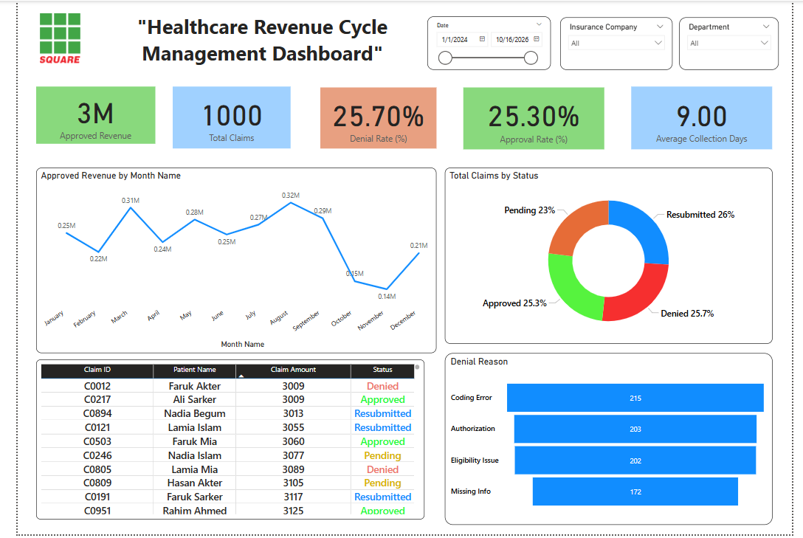

# 📊 Healthcare Revenue Cycle Management Dashboard

This project presents an interactive **Power BI Dashboard** that analyzes the financial and operational performance of the **Healthcare Revenue Cycle**, helping stakeholders monitor and improve **claim processing efficiency, revenue, and collection timelines**.

---

### 🏥 Dashboard Title:
**"Healthcare Revenue Cycle Management Dashboard"**

---

### 📅 Features and Filters
- **Date Range Filter**: Select a custom date range
- **Branch/Hospital Filter** *(optional)*
- **Claim Status**, **Department**, **Insurance Company** – via slicers

---

### 🎯 Key KPIs (Card Visuals)

| KPI Name                 | Description                                                  |
|--------------------------|--------------------------------------------------------------|
| ✅ Total Revenue          | মোট আয়                                                       |
| ✅ Total Claims Submitted | জমাকৃত ক্লেইম সংখ্যা                                           |
| ✅ Approval Rate (%)      | (Approved / Total Claims) × 100                              |
| ✅ Denial Rate (%)        | (Denied / Total Claims) × 100                                |
| ✅ Average Collection Days| Claim থেকে Payment পর্যন্ত গড় সময়                           |
| ✅ Pending Claims         | প্রসেসিংয়ে থাকা ক্লেইম সংখ্যা                                 |

---

### 📈 Visualizations

#### 1. Monthly Revenue Trend
- **Type**: Line / Area Chart
- Shows monthly revenue growth

#### 2. Claim Status Breakdown
- **Type**: Pie/Donut Chart
- Shows distribution of claim status (Approved, Denied, Pending)

#### 3. Claim Denial Reasons
- **Type**: Bar Chart
- Shows most common reasons for claim denials

#### 4. Average Collection Time by Department
- **Type**: Column Chart
- Compares collection efficiency across departments

#### 5. Claim Tracker Table
- **Type**: Table Visual
- Columns: Claim ID, Patient Name, Department, Service Date, Claim Amount, Status, Days to Collect

---

### 🛠️ Tools Used
- [Power BI Desktop](https://powerbi.microsoft.com/)
- Microsoft Excel (for synthetic dataset)
- DAX (Data Analysis Expressions)

---

### 📁 Dataset
Synthetic dataset of 1000 healthcare claim records including:
- Patient Info
- Claim Amounts
- Department
- Status
- Dates (Claim, Approval)
- Denial Reasons

> 📂 Dataset and PBIX files are stored in `/data` and `/dashboard` folders in this repository.

---

### 🌐 Live Dashboard (Published)
View the live interactive dashboard here:  
🔗 [Healthcare RCM Dashboard – Power BI](https://app.powerbi.com/view?r=eyJrIjoiZTM3NGQ0ZDItNjI5Zi00OWRjLTkzOGItNzkwMDg2OGJjZDU4IiwidCI6IjM0YmVhMGY1LTRlNmMtNDdjZC05NjFmLTIxMjA1ZGYxMjQ1MSIsImMiOjEwfQ%3D%3D)

---

### 📷 Dashboard Preview

---

### 📫 Contact
**Nahidul Islam**  
📧 Email: nahidul121274@gmail.com  
🔗 [LinkedIn](https://www.linkedin.com/in/nahidul63333)

---

